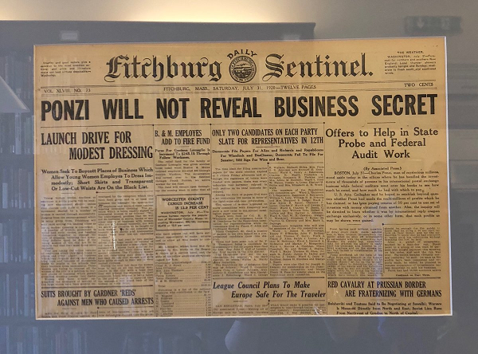
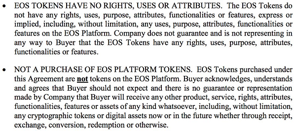
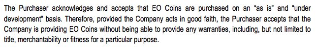
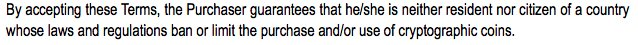
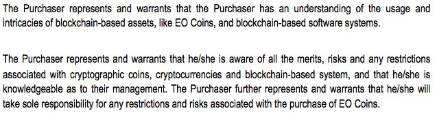

## Get Rich Quick - Business Secrets

People will believe anything, as long as it gives them an easy answer to the most important question in the universe: "how can I become rich quickly and without working?"
"International reply coupon exchange" sounded just as cool and mysterious as "censorship-resistant money".
-- [1 May 2018](https://twitter.com/Tr0llyTr0llFace/status/991330762178924544)

Investment opportunity: you can buy an inscription on an online registry that gives you absolutely no rights and no income. Also investors must pay $3B per year or the registry ceases to exist. BUT there's a limited number of registry entries so it must be worth a lot. #Bitcoin
-- [7 Mar 2018](https://twitter.com/Tr0llyTr0llFace/status/971531378985717760)

If you see this tweet, it's your lucky day, because you'll be lambo-rich in less than 24 hours.
All you need to do is send 0.1 BTC to all the addresses at the bottom of this message, & retweet by putting your own Bitcoin address at the top of the list!

Happy Easter everyone.
-- [1 Apr 2018](https://twitter.com/Tr0llyTr0llFace/status/980465304882073601)

Blockchain isn't a solution to fraud. There can be no technological fixes to human nature. If people want to believe that a 20-year-old nobody named Martin Shkreli will double their money in one year, no blockchain can save them.
Oh wait, I've just described 99% of ICO investors.
-- [9 Mar 2018](https://twitter.com/Tr0llyTr0llFace/status/972364721499320320)

The crypto cartel's smartest propaganda move was to create the HODLer culture. By glorifying the act of doing nothing, they reached out to the self-entitled, lazy millionaire wannabes.
Every Ponzi scheme relies on the hope that investors won't sell.
This one's just too obvious.
-- [17 Mar 2018](https://twitter.com/Tr0llyTr0llFace/status/974939067803631617)

DON'T BUY THE DIPS IN A FAILING PONZI SCHEME.
This is not financial advice. It's common sense.
It was also common sense not to buy magical virtual coins that will make you rich in no time on the Internet, but apparently some things need to be said more clearly.
-- [29 Mar 2018](https://twitter.com/Tr0llyTr0llFace/status/979304956992815105)

> Austrian Maximalist comments:
>
> Can I ask, when will you admit you were wrong?
> $50 000 bitcoin? $100 000 bitcoin? $500 000 bitcoin?

Please explain me why you guys keep claiming that Bitcoin will change the world in every way, but then all your arguments boil down to its price.
You can bid up the price as much as you want,
especially when hordes of lemmings hodl & don't sell.  
But it doesn't change the world.

> You can't answer the question because you know you are doomed to fail!

I will accept that I'm wrong the day when it will be more convenient for me to use Bitcoin (or any other cryptocurrency) than cash. This is what you should be focusing on. Pro tip: HODLing doesn't help to get the 99% of people who don't own crypto, on your side.

Why nobody cares about the "Lightning Network"? Because it has nothing to do with Bitcoin's fundamental promise: become rich without doing anything.
As long as Bitcoin's only interesting feature: its exponential price, is broken, people won't give a crap about your "technology".
-- [16 Mar 2018](https://twitter.com/Tr0llyTr0llFace/status/974574618500648960)

## Tokens - Utility? Security? Currency?

Crypto split: the act of telling regulators that your token "isn't a security or
a currency, it's no more than a database entry, really - people who buy it
must be morons !", while simultaneously telling your investors that they're somehow buying a stake in the Next Big Thing.
-- [3 May 2018](https://twitter.com/Tr0llyTr0llFace/status/992023195493568512)

## Greater Fools - BagHODLers Wanted

An investor buys an asset because he/she believes that it will generate future cash flows is greater than justify its price.
A crypto gambler buys a coin, no matter the price, because he/she believes that more people will buy it in the future.
It's a Ponzi scheme and you know it.
-- [4 Apr 2018](https://twitter.com/Tr0llyTr0llFace/status/981761046804402177)

Crypto for dummies

"Dude, are you insane? You gave your money to some guy nobody knows, with no experience, no track record, no product, at a valuation of $30m?!"
"That's OK, I have a plan!" Takes another big gulp of kerosene. "I'm gonna sell my worthless coins to someone else!"
-- [30 Apr 2018](https://twitter.com/Tr0llyTr0llFace/status/991053417048170496)

Piece of advice to all ICO investors: all product ideas, no matter how cool they sound, must be considered worthless until you meet someone who is ready to pay for said product.
Corollary: 95% of ICO ideas are shit. But you already knew that, and only bought in to flip the coins.
-- [11 Apr 2018](https://twitter.com/Tr0llyTr0llFace/status/983977103996674049)

## (Just) Believe! HODL! HODL! HODL! To the Moon!

In the mind of a Bitcoiner, humanity is divided into two camps: those who have bought Bitcoin, a.k.a. the illuminated, and those who have not, and are doomed to live in a state of perpetual jealousy and hate towards the illuminated for their superior intelligence and foresight.
-- [6 Apr 2018](https://twitter.com/Tr0llyTr0llFace/status/982498153504133120)

Bitcoin maximalists make me laugh with their pitiful P&Ls.
I found a weird stone the other day,
and we've been buying it from each other with a friend, ever since.
I'm up $57 000 last week alone.
Some idiots told me I couldn't sell my investment, well, WHY WOULD I? It's going up!
-- [24 Apr 2018](https://twitter.com/Tr0llyTr0llFace/status/988855025270251520)

> Austrian Maximalist comments:
>
> It can't be a bubble, not everyone has bought the stone yet. NO BUBBLE

If everyone on Earth wants to own Bitcoin, its price will go up x1,000.
If everyone on Earth wants to own old postal stamps, their price will go up x1,000 too.
At least you can't create old postal stamps out of thin air with the exact same features.
-- [2 Apr 2018](https://twitter.com/Tr0llyTr0llFace/status/980714667013296128)

Are HODLers the same people who used to buy land parcels on the Moon 20 years ago?
You get your name on some kind of an online registry: check.
You believe that you've purchased something valuable: check.
BUT you never intend to use it: check.
Your friends make fun of you: check.
-- [30 Jan 2018](https://twitter.com/Tr0llyTr0llFace/status/958308224620474368)

Remember, crypto bagHODLers, if a guy believes crypto is a scam, it's because he doesn't own any. Not the other way around. That's how human brains work - first you do some random shit, and then you rationalise it.
Well, maybe not everyone's brains. Maybe just bagHODLer brains.
-- [30 Apr 2018](https://twitter.com/Tr0llyTr0llFace/status/991201660675547136)

The crypto HODLer paradox is like the prisoner's dilemma.
Except there's no prison, just a bunch of guys sitting in a circle with a small bag of gold in the middle. As long as no one takes the bag, they can all imagine it's theirs.
The first one who gets up & takes the bag, wins.
-- [18 Apr 2018](https://twitter.com/Tr0llyTr0llFace/status/986599316386189312)

> Austrian Maximalist comments:
>
> Is that "small bag" getting bigger as they sit around?

Bitcoin maximalists have finally succeeded in shrinking the analytical part of their brains to the size of a mosquito's butthole. Any & all arguments about Bitcoin's success start and end with it's price.
Number go up = boast and self-congratulate, number go down = hide and pray.
-- [22 Apr 2018](https://twitter.com/Tr0llyTr0llFace/status/988126314673655810)

> Austrian Maximalist comments:
>
> Please tell me what gives gold its value.
> Industrial value is only ~$250/oz out of $1350 so it's not mostly that.
> And don't tell me that "it's jewelry/art/it's shiny"
> gives it the gold market the remaining $5 trillion dollars of value.
> so what accounts four most of its value?

Bitcoin's daily transaction volume in USD, last 2 years.
Down 80% from its peak.
I guess bagHODLers are right: "if you believe in the tech, you'll sit on it until hell boils over, never actually using the tech you so much believe in".
-- [27 Mar 2018](https://twitter.com/Tr0llyTr0llFace/status/978866088862736385)

If the community had any interest in turning Bitcoin into a currency, they would encourage HODLers to spend it. That's the only way to incentivise businesses to trade in Bitcoins, and provide an experimenting field to entrepreneurs and developers to come up with better solutions.
-- [22 Mar 2018](https://twitter.com/Tr0llyTr0llFace/status/976928395798904833)

## New New Economics - Crytpo Double Speak

Bitcoiners sound cool because they use crypto-slang. If nocoiners want to build a religion, they need their own cult-speak.
I've been pushing "bagHODLer" for a while, to no avail.
I'll continue to do so, but we need more.
How about "crater", which would be the opposite of "moon"?
-- [11 Apr 2018](https://twitter.com/Tr0llyTr0llFace/status/984122019624177665)

What does the whale say to the little fish when he wants to sell his useless virtual coins for real money?
Is it "hyperbitcoinization", "censorship resistant", "tokenization" or "trustless"?
Feel free to complete this list with all the bullshit words of crypto that don't mean anything.
-- [25 Apr 2018](https://twitter.com/Tr0llyTr0llFace/status/989139954675613697)

"It's not the coin that has value, it's the consensus" is cryptospeak for "build it, and they will come". Coins supposedly have value because they'll bring together smart people who right now have no means of cooperating.
Because they don't know the Internet exists, or something.
-- [4 May 2018](https://twitter.com/Tr0llyTr0llFace/status/992505016719208453)

By now everyone has realized coins have no value per se because it's just copy - paste of some previous code, with new bugs on top. So you to rationalize the hallucination that they're not useless, worthless trash, we need some new bullshit. Here it comes: consensus is the value.

## Revolutionize the World - Crypto Innovations

Groundbreaking innovations are the exception, not the rule.
A lot of things can go south: wrong team, bad technology choices, the world isn't there yet.
That's why investments are made in tranches, with clear milestones.
ICOs are revolutionary in that they're a total clown act.
-- [2 May 2018](https://twitter.com/Tr0llyTr0llFace/status/991587588778725376)

I've invented waterproof matches. They solve the problem of starting a fire in the rain. All you need is to find a shelter, & they work. Once the world is covered in shelters, it's gonna be amazing.
If you don't believe me, watch how their price has gone up on an exchange I run.
-- [30 Apr 2018](https://twitter.com/Tr0llyTr0llFace/status/991196554349465600)

Here's a real world use case for blockchain tech that's not stupid.
Go revolutionise the MERS system (US mortgage records). It poses a systemic risk, has led to billions in losses & fines.
This should be a piece of cake, knowing how powerful & amazing blockchains are. Easy money.
-- [22 Apr 2018](https://twitter.com/Tr0llyTr0llFace/status/987956035829817344)

Golem, an ICO that raised a gazillion of ETH a few years ago, just released their product, which allows anyone to sell their computer's computing power to imaginary people willing to pay for it.
Thousands of crypto investors are about to learn the meaning of "market fit".
-- [10 Apr 2018](https://twitter.com/Tr0llyTr0llFace/status/983766620995760128)

## No Freebies - No Taxes

It's amazing that so many people don't get how expensive crypto networks are. Networks pay miners rewards - for Bitcoin, it's around 1000 coins, or $8M, per day. Anyone can be a miner, so millions of crypto wannabes run their computers 24/7, burning said $8M/day in electricity.
-- [15 Mar 2018](https://twitter.com/Tr0llyTr0llFace/status/974335120332283904)

People assume that calculations behind Bitcoin network are useful, because they are "very complex". They aren't.
They are the equivalent of looking for a needle in a haystack, then throwing away the needle. The more people are looking for the needle, the bigger the haystack gets.
-- [11 Feb 2018](https://twitter.com/Tr0llyTr0llFace/status/962951879356485632)

How to troll your libertarian friends.
You: "I sure love the free public schools."
Friend: "Free? Sure, if you chose to forget about all the taxes!"
You: "Just like you chose to forget about block rewards that dilute the value of Bitcoins you're HODLing? Yeah, that kind of free".
-- [20 Mar 2018](https://twitter.com/Tr0llyTr0llFace/status/976206957081190400)

## There's Only Bitcoin

Bitcoin is a means to transfer money, nothing more.
It's like HODLers started to buy bank cheques, thinking, "whenever someone needs to write a cheque, they'll need to buy it from us".
"But whan if banks just print more cheques?"
"Ours are better because they are more expensive."
-- [13 Mar 2018](https://twitter.com/Tr0llyTr0llFace/status/973797099337895943)

> Austrian Maximalist comments:
>
> Fiat has value because he government and the federal reserve says so.
> Bitcoin has value because WE, THE PEOPLE say so.
> Deal with it, we will have the last say on what we determine has value.

Not "WE THE" people, "SOME" people. The fact that YOU believe in magical virtual coins that transfer $3 billion per year from holders to miners, and try to convince everyone else to throw their money into this scam, is YOUR decision, while MY responsibility is to warn people.

## Do Your Own Reading - What's a Book?

If you think books about the history of finance, financial regulation, and banking crises are a waste of time... Buying Bitcoin will be an expensive way to find out why we have regulations, securities laws, and that you didn't have it all figured out after reading McAfee's tweets.
-- [3 Mar 2018](https://twitter.com/Tr0llyTr0llFace/status/970180820102197248)

## Crypto Shill's Big Lies

I don't know what a side chain is. I don't know how exactly the Lightning Network is supposed to work.
But I've met with a lot of people who launch ICOs and run crypto PR. It's a who's who of swindlers and crooks. They know what they're doing. You don't. You're the little fish.
-- [11 Apr 2018](https://twitter.com/Tr0llyTr0llFace/status/984147213575180291)

If you are planning an ICO and your business plan includes financial projections and ideal customer profiles, you clearly don't understand how ICOs work.
What you really need is a cool landing page filled with "Change the World" bullshit and impossible to verify assumptions.
-- [11 Apr 2018](https://twitter.com/Tr0llyTr0llFace/status/983995487777849344)

Hello there, amazing revolutionary ICO that will change the world.
What does it mean when your "Co-Founder & CMO" has 15 (yes FIFTEEN) current positions (job & volunteer) listed on LinkedIn?
How can one be a thought-leader in blockchain, machine learning and AI at the same time?
-- [4 Apr 2018](https://twitter.com/Tr0llyTr0llFace/status/981786655265820672)

I remember 4 months ago clicking on the comments section of a Facebook ad for crypto that promised 50% yearly returns.
People were trashing the annual 50% dividend scheme as a scam because the returns were TOO LOW. "I make that in 2 days".
I guess they're all billionaires now.
-- [11 Apr 2018](https://twitter.com/Tr0llyTr0llFace/status/984154447906566145)

When you buy a company's shares, you get voting rights, plus a share of the profits.
When you buy ICO tokens, you get nothing - no voting rights, no share of any future profits, plus the tokens bleed money because miners have to be rewarded.
I'll call it the "bagholder economy".
-- [1 Mar 2018](https://twitter.com/Tr0llyTr0llFace/status/969288779289759744)

Crypto shill's starter pack:

1. Fraud sometimes happens in regulated markets too, so it's ok if it's rampant in crypto.
2. Some ICOs are legitimate, so it's like all of crypto is legitimate.
3. We're doing cutting edge innovation, but have nothing to show because it takes time.

-- [1 May 2018](https://twitter.com/Tr0llyTr0llFace/status/991572417360355328)

"Blockchain and ICOs have started an era of complex innovations and unprecedented disruptions in finance & economics.
However, retail investors are 100% capable of understanding
what's happening and need no regulations whatsoever."

The CEO of Ponzi Pyramid, Inc. announced he will only accept
interviews from journalists who stood to financially benefit from a positive coverage of his business.
He was tired of people who weren't relentlessly talking up his brand in a transparent effort to enrich themselves.
-- [28 Apr 2018](https://twitter.com/Tr0llyTr0llFace/status/990187557504897024)

The binance crook didn't ask for journalists who had tried crypto. He asked for journalists who were currently holding crypto. Hodling is an act of waiting for prices to moon.
A journalist hodling crypto cannot be trusted to write unbiaised articles on crypto.

## Initial Coin Offerings (ICOs)

- Let's do an ICO, man!
- What? Why?
- Because it's easy money! Once we get 30 million, we'll figure out what to do!
- No. I don't want to end up in jail.
- Come on, so many people are doing it, they won't be able to lock us all up!

actual conversation I just had
-- [21 Mar 2018](https://twitter.com/Tr0llyTr0llFace/status/976433050744705024)

Of the 902 ICOs listed on Tokendata for 2017, 46% have already failed, and 13% are deemed "unresponsive" to questions on social media.
ICOs fed BTC's & ETC's rise in 2017. Will investors keep buying tokens this year, & throw them away funding projects with no chances of success?
-- [24 Mar 2018](https://twitter.com/Tr0llyTr0llFace/status/977440607839891456)

An ICO is basically all rounds of funding in one go for a business without a business plan, customers, or even a product. And even if the team, by some miracle, manages to accomplish something, you have no claim on their success because all you have are stupid coins, not shares.
-- [4 May 2018](https://twitter.com/Tr0llyTr0llFace/status/992352987841552384)

> Austrian Maximalist comments:
> Just like those stupids BTCs from 2010 which were  worth less than a dime cause they
> were stupid and nobody understood them. And from an anonymous  creator/team with no
> regulation!

Your argument is bullshit. BTC didn't ICO. It wasn't created to get a lot of money quick
from people who don't understand what they're buying. Implying that ICOs are comparable
to Bitcoin is a criminal lie. Bitcoin was an accident. ICOs are intentional scams.

### Terms and Conditions

Current EOS token market cap: $15 billion.
The EOS token is a nothing. Literally nothing. See the excerpt from its purchasing agreement below.
This is a $15 billion scam in broad daylight, and morons invested in it think they're geniuses because the fake price of scamcoins is up.
-- [2 May 2018](https://twitter.com/Tr0llyTr0llFace/status/991930017058836480)

> Austrian Maximalist comments:
>
> Agree that terms are outrageous BUT fully informed purchasers chose to proceed.
> Perhaps investor discipline is in order?  These are signs of an out of equilibrium
> market.  Time and bad outcomes will fix this issue.  
>
> Austrian Maximalist comments:
>
>  No need for the SEC. The market will regulate itself.

The issue here is that ICOs exploit the implicit trust people have in markets. This trust was created by regulations where bad guys get punished. So retail investors, when they are offered an investment, believe that they won't get screwed by default. You can't have it both ways.

The world has become way too complex for people to read all the terms & conditions on every piece of packaging.
If we had to distrust everything and everyone at every step,
it's back to the Middle Ages.

ICO Terms & Conditions are always a  fun read, unless you intend to "invest" in the ICO. Then it's a pile of rotten garbage that screams "run away, you moron!"
Here's a fun one: "the coins you purchase are nothing, and might never become anything at any time in the future."
-- [8 May 2018](https://twitter.com/Tr0llyTr0llFace/status/993887598140633088)

ICO Terms & Conditions clownfest: the investor guarantees that he's not a resident of a country that might have laws intended to protect him, and certifies that the ICO crooks are free to stick it to him/her without any legal repercussions.
-- [8 May 2018](https://twitter.com/Tr0llyTr0llFace/status/993931810546618368)

ICO Terms & Conditions clownfest: the investor certifies that he's an expert in blockchain technology, cryptocurrency analysis, & the "intricacies" of the crypto ecosystem.
Notwithstanding the fact that not a single person on Earth qualifies, ICO crooks are off the hook... right?
-- [8 May 2018](https://twitter.com/Tr0llyTr0llFace/status/993932769150500865)

## Creative Disruption - Austrian School of Economics - Free Market Paradise

Theory:
"Blockchain tech is great, it will eliminate fraud and corruption."

Practice:
"Most ICOs are scams, crypto exchanges are crooked, so what? It sometimes happens in the real world, too."

Find people who believe both, and I'll sell them invisible boxes full of premium air.
-- [24 Apr 2018](https://twitter.com/Tr0llyTr0llFace/status/988822101917356033)

Bitcoiners think the world is due for a disruption. Banks will go bankrupt, governments will lose their power. And in the midst of this chaos, amid widespread blackouts & collapsing social fabric, what will make the difference is if you own a small piece of code on the Internet.
-- [24 Apr 2018](https://twitter.com/Tr0llyTr0llFace/status/989035883604201473)

## Bitcoin Gold Standard - Austrian School of Economics - Free Market Paradise

Bitcoiners try so hard to look like technological visionaries. They keep quoting the Austrian school of economics, something that's less of an economic theory than it's a few angry old men yelling at clouds.
In reality, Bitcoiners are the "they took our jobs" crowd in South Park.
-- [12 Apr 2018](https://twitter.com/Tr0llyTr0llFace/status/984512716823040000)

> Austrian Maximalist comments:
>
> Actually those who will be screaming "they took our jobs",
> post hyperbitcoinization are bankers and middlemen in financial services.

If we used Bitcoin as money, loans would become prohibitively expensive. No more credit cards or mortgages. Every crisis worsened by deflation as nobody can borrow to wait it out. Mass layoffs, bankruptcies. Power concentrated in the hands of a few HODLers. Aka the 17th century.
-- [6 Apr 2018](https://twitter.com/Tr0llyTr0llFace/status/982232964833538053)

> Austrian Maximalist comments:
>
> You may want to dip your toes into Austrian economics authors
> to realize how wrong that statement is.

This hundred-year-old libertarian theory about how central banking unfairly distorts the economy, and how it would be much better to watch the world burn every ten years, instead of having mild recessions now and then?

> Austrian Maximalist comments:
>
> We live in a different world, what worked in the past won't work again.

Fiat is not a problem. It's the solution to problems that arose from the use of money founded on the same principles as Bitcoin.
Taking a failed concept & putting it on the Internet doesn't solve anything.
Crypto crooks are scamming those who are too lazy to learn from the past.
-- [5 Apr 2018](https://twitter.com/Tr0llyTr0llFace/status/981842880124858368)

With Bitcoin, you can be your own bank! Unless you need to take out a loan. Or get a mortgage. Or a credit card. Or, basically, anything but a wire transfer.
Bitcoiners' understanding of what a bank does makes me think of a 5-year-old with a lemonade stand thinking he's Walmart.
-- [12 Apr 2018](https://twitter.com/Tr0llyTr0llFace/status/984507088574480385)

> Austrian Maximalist comments:
>
> Taking out a loan, credit cards and basically everything
> the banking industry does is why we're in this mess now.

Do Bitcoin maximalists know fractional reserve banking precedes the Fed & was in practice, unregulated, during the gold standard? A limited supply of money made bank runs &failures much more frequent, without addressing any of the problems cryptoclown experts claim it will solve.
-- [8 May 2018](https://twitter.com/Tr0llyTr0llFace/status/993872059175522304)

> Austrian Maximalist comments:
> Crypto doesn't solve "bank runs & failures", free market solves that.
> In a free market society you are free to put your money in a fractional or in a non
> fractional bank. Probably the 1st is less secure but charges less or pays more.
> But, who needs bank when there's BTC

Everything comes down to the same problem: you cannot expect all people to be well informed. The modern world is too complex. You can't assume everyone is able to read a bank's balance sheet and decide if it's creditworthy or not. The free market is a dentist with a hammer.

Crypto economy experts who think limited money supply is great should read any book about the 19th century. States & companies defaulted every 20 years, or had to pillage to pay back creditors. You would have lost your wealth by sword or default. How is it better than inflation?
-- [4 Apr 2018](https://twitter.com/Tr0llyTr0llFace/status/981436758570295296)

## Bubble Investing Game?

This multiplayer online crypto investing game is super realistic. You've got everything: "news", "charts", "IPOs", "companies" & "profits".
But to play you WILL need to spend a lot on in-app purchases of coins, because the ones you get for free are pretty useless.
My rating: 3/5.
-- [23 Apr 2018](https://twitter.com/Tr0llyTr0llFace/status/988670144510644226)

Remember, Bitcoin bulls, in three years, you won't even be able to see this small $14,000 correction on the Bitcoin chart!
To change that, you'll need to go to Edit > Chart Settings > Defaults > Time Frame, and select "3 years" instead of "2 years".
Then you'll be able to see it.
-- [13 Apr 2018](https://twitter.com/Tr0llyTr0llFace/status/984735808233058304)

> Austrian Maximalist comments:
> "Then you'll be able to see it."
> from your Lambo cause BTC will be over the moon.

## 100% Trustless?

Businesses accept cryptocurrencies because they hope they'll be able to transfer the sale proceeds to an online exchange, sell against fiat & wire the fiat to their bank accounts.
Cryptocurrencies are a trustless payment system in the sense that trust has been replaced with hope.
-- [9 Apr 2018](https://twitter.com/Tr0llyTr0llFace/status/983322806078320640)

Bitcoin is the perfect trustless currency.
To get involved, simply give your credit card number and ID copy to a website you don't know, hoping that a piece of code you have never read will make you rich, because a guy on Twitter you've never met told you so.

100% TRUST-LESS.
-- [20 Apr 2018](https://twitter.com/Tr0llyTr0llFace/status/987411498921353216)

## (Crypto Currency) Exchanges

Cryptocurrency exchanges are unregulated, unaudited entities where insiders trade against clients.
It's the equivalent of a roulette table at an underground casino, where the mob boss looks at all the bets on the table & then decides which number will come up.
Don't trade crypto.
-- [4 Apr 2018](https://twitter.com/Tr0llyTr0llFace/status/981769815349190658)

If cryptocurrency exchange insiders are allowed to trade on their own exchange, other traders don't stand a chance.
Insiders know the stop orders of everyone else. They can push the market to execute said orders, at no risk of their own.
You call it "volatility", I call it fraud.
-- [11 Mar 2018](https://twitter.com/Tr0llyTr0llFace/status/972816613488693249)

> Austrian Maximalist comments:
>
> If it's a fraudulent market, then don't trade it.
> There are thousands of markets to trade.

Hurry! It's probably the last time you'll be able to sell your magic internet coins above $8000 to some sucker trying to flip them to another sucker trying to flip them to another sucker.
-- [11 May 2018](https://twitter.com/Tr0llyTr0llFace/status/995185725846024192)

Crypto exchanges cooking their books should be the last nail in cryptocurrencies' coffin. Virtual magical coins are nothing without exchanges where they can be sold to suckers for real money.
Sit back & enjoy the show of crypto clowns shitting their pants as their scam collapses.
-- [11 May 2018](https://twitter.com/Tr0llyTr0llFace/status/995191433576493056)

## Blockchains like the Early Internets Days

Bitcoin is like the Internet in 1996 - if instead of building websites, everyone just bought up domain names and waited for their prices to moon.
How is the ecosystem supposed to evolve, if nobody is using the tech for its purpose?
Unless HODL turns into SPEDN, Bitcoin is a joke.
-- [8 Apr 2018](https://twitter.com/Tr0llyTr0llFace/status/982907768976834561)

> Austrian Maximalist comments:
>
> You're kidding yourself if you think people bought dotcom stock in the 90s for
> any reason other than to get rich. The huge flow of cash into the field attracted
> best talent & fueled innovation.
> Same thing here. Sit back & relax. Up or down, we're in this together.

Yes unregulated and unchecked flows of money always attract the best people. I'll go get my popcorn.

> Austrian Maximalist comments:
>
> The person who bought http://pizza.com and held it sold
> it for $2 million dollars with no website or product
> just the domain name.... #HODL

It's difficult to keep up with all the innovations in the Bitcoin space. Bitcoin Cash, SegWit, the Lightning Network... every 3 months, a new ground-breaking and revolutionary technology is born, attempting to solve some problem we never had before Bitcoin.
-- [5 Apr 2018](https://twitter.com/Tr0llyTr0llFace/status/982102056910516226)

> Austrian Maximalist comments:
>
> Every new tech brings new problems.
> By your logic, we should just close down the internet,
> because it wasn't perfect from day one....

When CNBC tells you that Bitcoin is very much undercovered and unknown of the public.
When tweets forecasting Bitcoin at $50 000 get thousands of likes and retweets.
THEN you know it's safe to buy Bitcoin, because you're super early, kinda like an Internet investor in the 1980's.
-- [15 Apr 2018](https://twitter.com/Tr0llyTr0llFace/status/985588703207845888)

"Blockchain is like the Internet, and cryptocurrencies are like Internet stocks."
Although these statements make no sense when you know a little bit of technology, finance or history, if you believe them, you should google what happened to Internet stocks. Hint: way of the dodo.
-- [29 Apr 2018](https://twitter.com/Tr0llyTr0llFace/status/990822186331058176)

## Blockchain a Database?

Being a blockchain enthusiast must be so nerve wrecking.
You keep seeing headlines like "Company X just used blockchain to do Y", & you get pumped up. This is it! It's happening!
Then you read the article & you realise X just used blockchain as a database to digitise some papers.
-- [25 Apr 2018](https://twitter.com/Tr0llyTr0llFace/status/989364328934641664)

For corporations, blockchain technology will be as disrupting and revolutionary as email and computer databases put together.
Unless they already use email and databases. Then it will just slow them down.
-- [25 Apr 2018](https://twitter.com/Tr0llyTr0llFace/status/989366042983124992)

I'm moonlighting as a blockchain consultant.
If you want your organisation to be on top of things & save millions of dollars, you need me.
At $500/hr, I don't come cheap, but my advice is priceless.
Here's a peek at the first slide of my presentation:

DO YOU KNOW SQL EXISTS?
-- [28 Apr 2018](https://twitter.com/Tr0llyTr0llFace/status/990142163039244288)

## (Crypto Currency) Applications

### Steem

Anyone who can explain how Steemit is not a Ponzi scheme gets 1,000 Trolly coins.
Everyone who comments or upvotes the explanation gets some Trolly coins, too.

Trolly coins are very valuable because they are scarce, even if I don't have any revenue whatsoever to back them up.
-- [10 May 2018](https://twitter.com/Tr0llyTr0llFace/status/994595501860360193)

## Glossary - Free Easy Money, Money, Money Corrupts

**Stop the FUD**

"Stop the FUD" used to mean:

"Stop posting negative stuff about Bitcoin, I'm trying to make money here!"

Now it means

"Stop trying to warn people about this pump & dump, I'm trying to make money here!"

-- [28 Jan 2018](https://twitter.com/Tr0llyTr0llFace/status/957616012047810561)

**Just HODL**

"Just HODL" used to mean:

"Bitcoin is going up, it's a bull market, don't panick and you won't sell at the bottom of the dip!"

Now it means

"I'll sure want to be the first one to sell when this pile of garbage pumps up again!"

-- [28 Jan 2018](https://twitter.com/Tr0llyTr0llFace/status/957616012047810561)

**Hard Fork**

"Hard fork" used to mean:

"The Bitcoin dev community is aware of the fundamental flaws of the network, but they can't agree on the perfect solution, so we're splitting up!"

Now it means

"Time for another crypto dividend for the glorious investors!"

-- [28 Jan 2018](https://twitter.com/Tr0llyTr0llFace/status/957616012047810561)

**ICO**

"ICO" used to mean:

"I kinda have a business idea, and raising cash this way seems easier than venture capital!"

Now it means

"I'll put toothpaste on the blockchain, give me Bitcoin and you'll get 46% ROI guaranteed!"

-- [28 Jan 2018](https://twitter.com/Tr0llyTr0llFace/status/957616012047810561)
